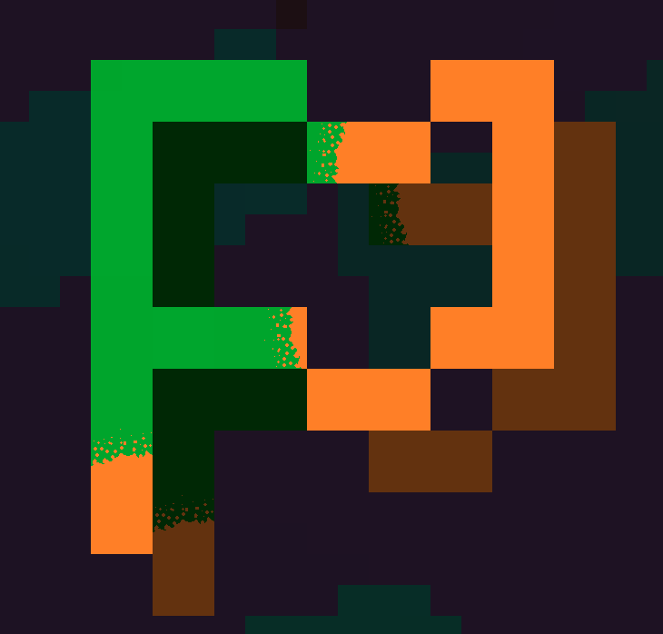

# MCOvertake


*A DiamondFire Conquest mini-game remake*

**Now ready for beta testing!**

MCOvertake is a multiplayer-strategy game based off the (un)popular DiamondFire mini-game
"conquest" by Sputt. In MCOvertake you create an empire by claiming land, attacking other
players, and constructing a variety of buildings to generate more power.

## Building from source
Clone the remote git repo to a local folder

```git clone https://github.com/FlyingPig525/MCOvertake.git```

Open the resulting folder in IntelliJ IDEA, or another Kotlin IDE, as a gradle project (or just use a terminal).
Main.kt will have errors, as the ksp module has not generated the required code for a
couple functions. To do this, either `./gradlew build` or create a configuration to run
the `MainKt` class.

If you would like a standalone jar file, instead of running the server in your IDE, you
can run `./gradlew shadowJar` which will create a fat jar file in the `build/libs`
directory. The resulting jar can be run with `java -jar MCOvertake-[version].jar`