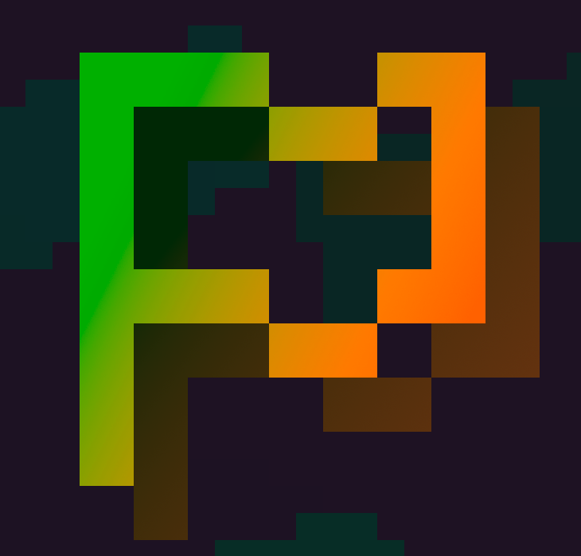

# MCOvertake

*A DiamondFire Conquest mini-game remake*

MCOvertake is a multiplayer-strategy game based off the (un)popular DiamondFire mini-game
"conquest" by Sputt. In MCOvertake you create an empire by claiming land, attacking other
players, and constructing a variety of buildings to generate more power.

## How to Play

### Formatting Key
- Item Names - Bold
- Resource Names - Italics
- Building Names - Bold & Italics

### Guide

Once joining the server for the first time, or after a reset, you must select a block from a large (slowly) hand-picked
list. To begin your reign of terror find a large chunk of grass blocks and place a colony, this can be done by
right-clicking grass with the **Instantiate Colony** item, once you've created a colony you can continue expanding by 
right-clicking more grass with the **Expand** item. As you expand you may notice the value in your *Power* boss bar
decreases, this is because expanding and placing colonies cost this critical resource; however, after a "power-tick", or
70 game-ticks, your *Power* will regenerate, by 0.5. To increase the speed at which you generate *Power* you must construct
a building. To open the building blueprint screen right-click the **Blueprint Constructor** item, this will display a
list of buildings. Each building has description that displays the effect and the *Material* cost. The building we need
to focus on is the ***Training Camp***, which increases the rate at which you generate power by 0.5. This guide just shows
the basics, and the rest of the game must be learned in-game, so find a server running this software, or host it yourself,
and have fun!